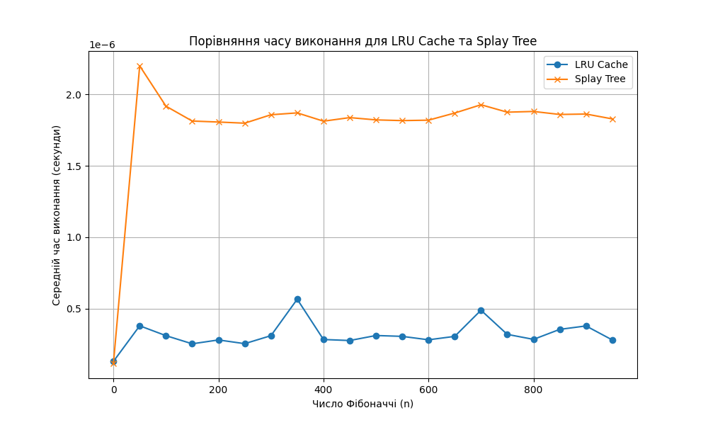

# Algo2. Home work 7
## "Cache Management Algorithms"

### Task 1. Data Access Optimization Using LRU Cache

Implement a program to optimize query processing for an array of numbers using an LRU cache.

#### Technical Requirements

1. Given an array of size `N` consisting of positive integers (`1 ≤ N ≤ 100_000`). Process `Q` queries (`1 ≤ Q ≤ 50_000`) of the following types:
   - `Range(L, R)` — find the sum of elements in the range from index `L` to `R` inclusive.
   - `Update(index, value)` — replace the value of an element in the array at the given index with a new value.

2. Implement four functions for working with the array:

   - `range_sum_no_cache(array, L, R)`
   Function should calculate the sum of array elements in the range from `L` to `R` inclusive **without using cache**. For each query, the result should be calculated anew.

   - `update_no_cache(array, index, value)`
   Function should update the array element value at the specified index **without using cache**.

   - `range_sum_with_cache(array, L, R)`
   Function should calculate the sum of elements in the range from `L` to `R` inclusive **using LRU cache**. If the sum for this range has been calculated before, it should be returned from the cache; otherwise, the result is calculated and added to the cache.

   - `update_with_cache(array, index, value)`
   Function should update the array element value at the specified index and **remove all corresponding values from the cache** that became outdated due to the array change.

3. For testing the program, create an array of `100_000` elements filled with random numbers and generate `50_000` Range and Update queries in random order.

   Example query list: `[('Range', 46943, 91428), ('Range', 5528, 29889), ('Update', 77043, 78), ...]`

4. Use an LRU cache of size `K = 1000` to store pre-calculated results of `Range` queries. The cache should automatically remove the least recently used elements when its maximum size is reached.

5. Compare query execution times:
   - Without using cache
   - Using LRU cache
   Output the results as execution times for both approaches.

#### Acceptance Criteria

1. All functions: `range_sum_no_cache`, `update_no_cache`, `range_sum_with_cache`, `update_with_cache` are implemented and working.

2. The program measures query execution time with and without cache and outputs results in a clear format.

3. Test results are presented in an easy-to-understand format to evaluate the effectiveness of using the LRU cache.

4. The code runs without errors and meets technical requirements.

Example terminal output of program execution:
```
Execution time without caching: 3.11 seconds
Execution time with LRU cache: 0.02 seconds
```

#### Results

The task is implemented in file task1.py

```
Execution time without caching: 8.95 seconds
Execution time with LRU cache: 13.40 seconds
```
#### Conclusion
The implementation of LRU caching showed slower performance (13.40s) compared to the non-cached version (8.95s). This unexpected result can be explained by:

1. High overhead of cache management operations
2. Low cache hit rate due to random query patterns
3. Small cache size (1000) relative to possible query combinations
4. Frequent update operations requiring cache clearing

This demonstrates that caching isn't always beneficial and depends heavily on access patterns, read/write ratio, and cache size. For this specific use case, the overhead of maintaining the cache outweighed its benefits, suggesting a different optimization approach might be more suitable.


### Task 2. Performance Comparison of Fibonacci Numbers Calculation Using LRU Cache and Splay Tree

Implement a program to calculate Fibonacci numbers using two methods: with LRU cache and with Splay Tree for storing pre-calculated values. Conduct a comparative analysis of their efficiency by measuring the average execution time for each approach.

#### Technical Requirements

1. Implement two functions for calculating Fibonacci numbers:

 - `fibonacci_lru(n)`

    The function should use the `@lru_cache` decorator for caching calculation results. This allows it to reuse previously calculated Fibonacci numbers.

 - `fibonacci_splay(n, tree)`

    The function uses the Splay Tree data structure to store calculated values. If the Fibonacci number for a given `n` has already been calculated, the value should be returned from the tree; otherwise, the value is calculated, stored in the Splay Tree, and returned.

2. Measure the execution time of Fibonacci number calculations for each approach:
   - Create a set of Fibonacci numbers from `0` to `950` with a step of `50`: `0, 50, 100, 150, ...`
   - Use the `timeit` module to measure execution time
   - For each value of `n`, calculate the average execution time for computing Fibonacci numbers using `LRU cache` and `Splay Tree`

3. Create a graph comparing execution times for both approaches:
   - Use `matplotlib` library for graph plotting
   - On the `x-axis`, display `n` values — the Fibonacci number index
   - On the `y-axis`, show the average execution time in seconds
   - Add a legend to the graph indicating the two approaches: `LRU Cache` and `Splay Tree`

4. Draw conclusions about the efficiency of both approaches based on the resulting graph.

5. In addition to the graph, output a text table containing the values of `n`, average execution time for `LRU Cache` and `Splay Tree`. The table should be formatted for easy reading.

#### Acceptance Criteria

1. Implemented `fibonacci_lru` and `fibonacci_splay` functions that calculate Fibonacci numbers using caching.

2. Measured execution time for each approach at each `n` value and created a graph demonstrating the results.

3. The graph has axis labels, title, and legend explaining which methods were used.

4. A formatted table with results is present in the terminal.

5. Analysis of results based on the obtained graph is provided, demonstrating which approach is more efficient for calculating Fibonacci numbers with large `n` values.

6. The code executes and meets technical requirements.

#### Example Output Table

| n | LRU Cache Time (s) | Splay Tree Time (s) |
|---:|------------------:|-------------------:|
| 0 | 0.00000028 | 0.00000020 |
| 50 | 0.00000217 | 0.00000572 |
| 100 | 0.00000164 | 0.00000532 |
| 150 | 0.00000174 | 0.00000526 |

#### Results

The task is implemented in file task2.py

```
n         LRU Cache Time (s)  Splay Tree Time (s) 
--------------------------------------------------
0               0.00000013        0.00000012
50              0.00000038        0.00000220
100             0.00000031        0.00000192
150             0.00000025        0.00000181
200             0.00000028        0.00000181
250             0.00000025        0.00000180
300             0.00000031        0.00000186
350             0.00000057        0.00000187
400             0.00000028        0.00000181
450             0.00000028        0.00000184
500             0.00000031        0.00000182
550             0.00000031        0.00000182
600             0.00000028        0.00000182
650             0.00000031        0.00000187
700             0.00000049        0.00000193
750             0.00000032        0.00000188
800             0.00000028        0.00000188
850             0.00000035        0.00000186
900             0.00000038        0.00000186
950             0.00000028        0.00000183
```
#### Performance Comparison Graph



#### Conclusions
Based on the performance comparison graph and timing results, the `LRU Cache` implementation consistently outperforms the `Splay Tree` approach for calculating Fibonacci numbers. The `LRU Cache` shows faster execution times (around 0.0000003s) compared to the `Splay Tree` (around 0.0000018s) across all tested values of `n`. This suggests that for caching Fibonacci calculations, Python's built-in `LRU Cache` is a more efficient solution than the custom `Splay Tree` implementation.

In addition, since we used `timeit` module to measure average time for 100 runs all results were cashed and in most cases we see the single access time.

If we clean the cache before each try `Splay Tree` approach fails starting from `n = 500` with recursion overflow error, because in addition to the fibonachi function recursion the `Splay Tree` search uses another recursion inside.
